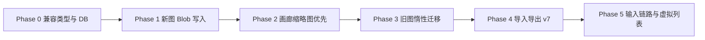

# Blob 存储迁移开发路线图

## 本文目标

本文给出 Blob 主存储迁移与画廊展示优化的实际开发路线图。
目标不是一次性重写所有图片链路，而是按照低风险、可回退、可验收的顺序逐步推进。

## 路线图总览

```text
+----------+------------------------------+------------------------------+
| 阶段     | 目标                         | 结果                         |
+----------+------------------------------+------------------------------+
| Phase 0  | 建兼容类型与 DB 基础能力     | 新旧数据可共存               |
+----------+------------------------------+------------------------------+
| Phase 1  | 新生成图改 Blob 主存储       | 新图不再落 dataUrl           |
+----------+------------------------------+------------------------------+
| Phase 2  | 画廊切到缩略图优先           | 列表解码压力明显下降         |
+----------+------------------------------+------------------------------+
| Phase 3  | 旧 dataUrl 惰性迁移          | 老图库逐步转 Blob            |
+----------+------------------------------+------------------------------+
| Phase 4  | 导入导出升级到 v7            | 备份恢复走 Blob 主路径       |
+----------+------------------------------+------------------------------+
| Phase 5  | 输入编辑链路和虚拟列表优化   | 收口剩余 dataUrl 热路径      |
+----------+------------------------------+------------------------------+
```



## Phase 0：兼容类型与 DB 基础能力

### 目标

- 引入新的 `StoredImage` 三态结构
- 升级 IndexedDB 到 v2
- 不改变现有 UI 行为

### 主要改动

```text
+--------------------------------------------------------------+--------------------------------------+
| 位置                                                         | 动作                                 |
+--------------------------------------------------------------+--------------------------------------+
| src/types.ts                                                 | 引入 local_blob / remote_url / legacy_data_url |
+--------------------------------------------------------------+--------------------------------------+
| src/lib/db.ts                                                | DB_VERSION 1 -> 2，新增 helper       |
+--------------------------------------------------------------+--------------------------------------+
| src/store/cache.ts                                           | 设计分级缓存接口，但先兼容旧行为      |
+--------------------------------------------------------------+--------------------------------------+
```

### 交付标准

- 旧库可正常打开
- 老图仍可展示
- 新 helper 可同时读写新旧结构
- 不修改 `TaskRecord` schema

### 风险

- DB 升级代码写错会影响已有浏览器本地库
- `StoredImage` 联合类型改动会波及大量编译错误

### 建议策略

- 先保留旧 `storeImage(dataUrl)` 作为兼容包装器
- 新增 `storeImageBlob()` 和 `getImageRecord()`
- 先让类型可共存，再开始切主写入路径

## Phase 1：新生成图切 Blob 主写入

### 目标

- 新生成结果图改为 Blob 主存储
- 保留当前 SSE 拆流逻辑
- 不把 `partial_image` 写正式库

### 主要改动

```text
+--------------------------------------------------------------+--------------------------------------+
| 位置                                                         | 动作                                 |
+--------------------------------------------------------------+--------------------------------------+
| src/lib/api/types.ts                                         | API 图片结果从 string[] 改资产数组   |
+--------------------------------------------------------------+--------------------------------------+
| src/lib/api/helpers.ts                                       | base64 -> Blob，替换最终落图链路     |
+--------------------------------------------------------------+--------------------------------------+
| src/lib/api/responses.ts                                     | streamedImages 改为 blob 资产流      |
+--------------------------------------------------------------+--------------------------------------+
| src/lib/api/images.ts                                        | JSON 路径改为 blob 资产输出          |
+--------------------------------------------------------------+--------------------------------------+
| src/store/runtime.ts                                         | appendOutputImages 改 storeImageBlob |
+--------------------------------------------------------------+--------------------------------------+
```

### 交付标准

- 新生成图不再以 `dataUrl` 落到 IndexedDB
- 新生成图能正常出现在画廊、详情、灯箱
- 原有任务提交和停止逻辑不回归
- SSE 大图流程不因 Blob 化失稳

### 风险

- base64 解码瞬时峰值仍然存在
- 如果把解析和落库耦合，会拖慢流式读取

### 建议策略

- 解析线程只做 `base64 -> Blob`
- 写入走顺序队列
- `atob()` 分段解码

## Phase 2：画廊切缩略图优先

### 目标

- 画廊卡片不再直接展示原图
- 元数据从持久化记录读取，不再每卡额外解码原图

### 主要改动

```text
+--------------------------------------------------------------+--------------------------------------+
| 位置                                                         | 动作                                 |
+--------------------------------------------------------------+--------------------------------------+
| src/lib/db.ts                                                | 写入时生成 thumbnailBlob             |
+--------------------------------------------------------------+--------------------------------------+
| src/store/cache.ts                                           | thumbSrcCache / originalSrcCache     |
+--------------------------------------------------------------+--------------------------------------+
| src/features/gallery/components/task-card/useTaskCardState.ts| 卡片优先读缩略图和持久化元数据       |
+--------------------------------------------------------------+--------------------------------------+
| src/features/gallery/components/task-card/TaskCardPreviewStatusLayer.tsx | 保持 UI，不改渲染语义      |
+--------------------------------------------------------------+--------------------------------------+
```

### 交付标准

- 画廊卡片只读 `thumbnailBlob`
- 详情和灯箱继续读原图
- 卡片比例、尺寸直接读记录字段
- 大图库滚动更平稳

### 风险

- 缩略图生成耗时可能影响落库吞吐
- 对象 URL 如果不回收，会转化成另一类内存泄漏

### 建议策略

- 缩略图允许异步补齐
- `deleteCachedImage()` / `clearImageCaches()` 强制 `revokeObjectURL`
- 缩略图缓存容量大于原图缓存

## Phase 3：旧 dataUrl 图惰性迁移

### 目标

- 历史 `legacy_data_url` 逐步迁移为 `local_blob`
- 保证过程不阻塞首屏

### 主要改动

```text
+--------------------------------------------------------------+--------------------------------------+
| 位置                                                         | 动作                                 |
+--------------------------------------------------------------+--------------------------------------+
| src/store/cache.ts                                           | 读取 legacy 图时触发后台迁移         |
+--------------------------------------------------------------+--------------------------------------+
| src/lib/db.ts                                                | 提供 migrateLegacyImageRecord        |
+--------------------------------------------------------------+--------------------------------------+
| src/store/runtime.ts                                         | initStore 后挂后台分批迁移任务       |
+--------------------------------------------------------------+--------------------------------------+
```

### 交付标准

- 旧图可正常显示
- 旧图会在后台逐步转成 Blob
- 旧图迁移后不改 `id`
- 迁移后补齐缩略图和元数据

### 风险

- 一次性迁移过多会卡顿
- 迁移时若写错 `id` 语义会破坏任务引用

### 建议策略

- 单次批量控制数量
- 使用 `requestIdleCallback` 或低优先级调度
- 永远不改旧记录 `id`

## Phase 4：导入导出升级到 v7

### 目标

- 备份文件改为 Blob 主格式
- 保持对旧 v6 备份的兼容导入

### 主要改动

```text
+--------------------------------------------------------------+--------------------------------------+
| 位置                                                         | 动作                                 |
+--------------------------------------------------------------+--------------------------------------+
| src/store/dataTransfer.ts                                    | manifest version 6 -> 7              |
+--------------------------------------------------------------+--------------------------------------+
| src/store/dataTransfer.ts                                    | bytes 直接写 Blob，不再转 dataUrl    |
+--------------------------------------------------------------+--------------------------------------+
| src/types.ts                                                 | 更新 ExportData 结构                 |
+--------------------------------------------------------------+--------------------------------------+
```

### 交付标准

- 新导出 ZIP 包含原图和缩略图二进制
- 新导入直接写 Blob
- 老 v6 ZIP 仍能导入

### 风险

- 不同版本 manifest 兼容分支复杂
- 漏处理缩略图路径会导致画廊回退到原图

### 建议策略

- 导入逻辑显式按版本分支
- v6 和 v7 读取逻辑分开，不要混成隐式兜底

## Phase 5：输入编辑链路与列表进一步优化

### 目标

- 收口剩余 `dataUrl` 热路径
- 让画廊从“加载更多”升级为真正虚拟列表

### 主要改动

```text
+--------------------------------------------------------------+--------------------------------------+
| 位置                                                         | 动作                                 |
+--------------------------------------------------------------+--------------------------------------+
| src/store/imageEditActions.ts                                | 编辑器优先读 Blob / blob: URL        |
+--------------------------------------------------------------+--------------------------------------+
| src/lib/api/helpers.ts                                       | Blob -> dataUrl 仅保留 API 边界用途  |
+--------------------------------------------------------------+--------------------------------------+
| src/features/gallery/components/task-grid/*                  | 引入真正 windowing / 虚拟列表        |
+--------------------------------------------------------------+--------------------------------------+
| src/features/gallery/components/task-grid/useTaskGridDerivedState.ts | 降低全量排序和筛选计算         |
+--------------------------------------------------------------+--------------------------------------+
```

### 交付标准

- 输入参考图和蒙版改为按需 dataUrl 化
- 画廊可视区外 DOM 不再长期保留
- 搜索和筛选计算压力下降

### 风险

- 虚拟列表会影响框选、多选、右键菜单、滚动定位
- 编辑链路仍有较多字符串接口，重构面相对更广

### 建议策略

- 虚拟列表放在 Blob 主存储稳定后再做
- 先保持交互语义，再做性能收敛

## 各阶段验收口径

```text
+----------+----------------------------------------------+
| 阶段     | 最低验收标准                                 |
+----------+----------------------------------------------+
| Phase 0  | 新旧结构共存，老图可读                       |
+----------+----------------------------------------------+
| Phase 1  | 新生成图不再落 dataUrl                       |
+----------+----------------------------------------------+
| Phase 2  | 画廊预览只读缩略图                           |
+----------+----------------------------------------------+
| Phase 3  | 老图可后台迁移，不改任务引用                 |
+----------+----------------------------------------------+
| Phase 4  | v7 可导入导出，v6 可兼容导入                 |
+----------+----------------------------------------------+
| Phase 5  | 输入链路收口，列表滚动与筛选进一步优化       |
+----------+----------------------------------------------+
```

## 推荐推进顺序

如果只做最小闭环，推荐先完成：

1. Phase 0
2. Phase 1
3. Phase 2

这三个阶段完成后，核心收益已经到位：

- 新图不再长期保存为 `dataUrl`
- 原图完整保留
- 画廊不再直接解码原图做缩略图

之后再按资源安排推进：

1. Phase 3
2. Phase 4
3. Phase 5

## 最终结论

推荐把 Blob 迁移拆成“兼容层 -> 新图写入 -> 画廊优化 -> 旧图迁移 -> 导入导出 -> 输入编辑收口”六个阶段。
这样推进的好处是：

- 每一阶段都可独立交付
- 每一阶段都可观察收益
- 不必一次性打碎当前稳定的大图 SSE 链路
- 旧数据和新数据可以长期共存，直到迁移完成
